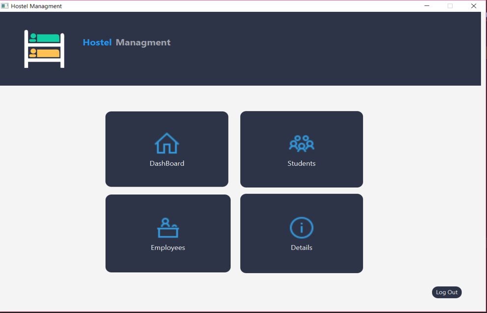
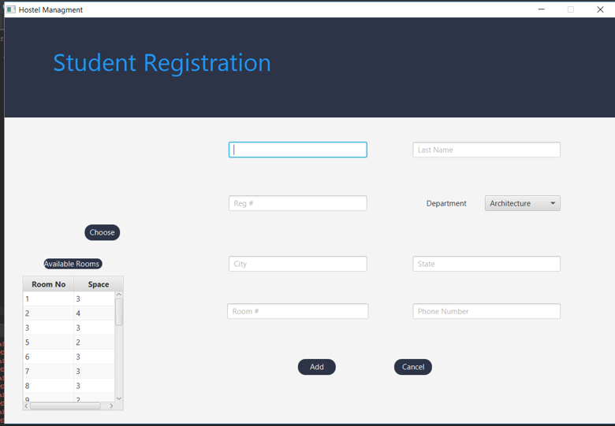
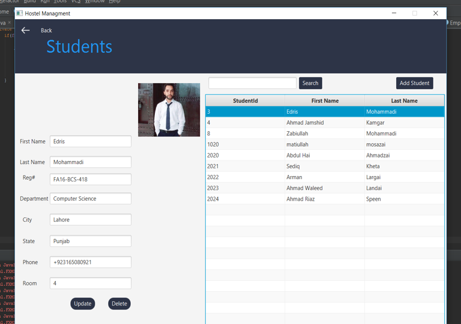
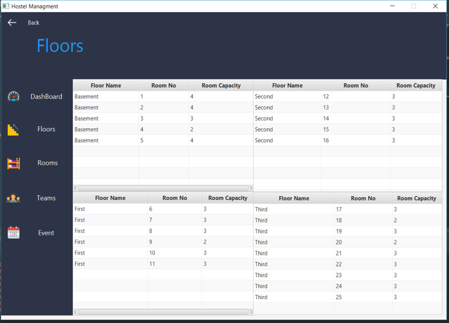
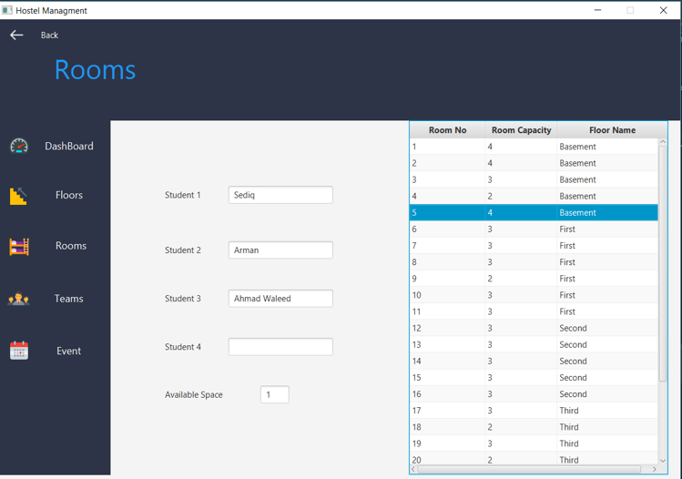
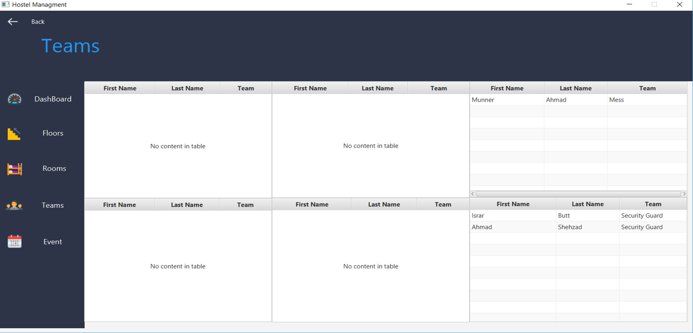
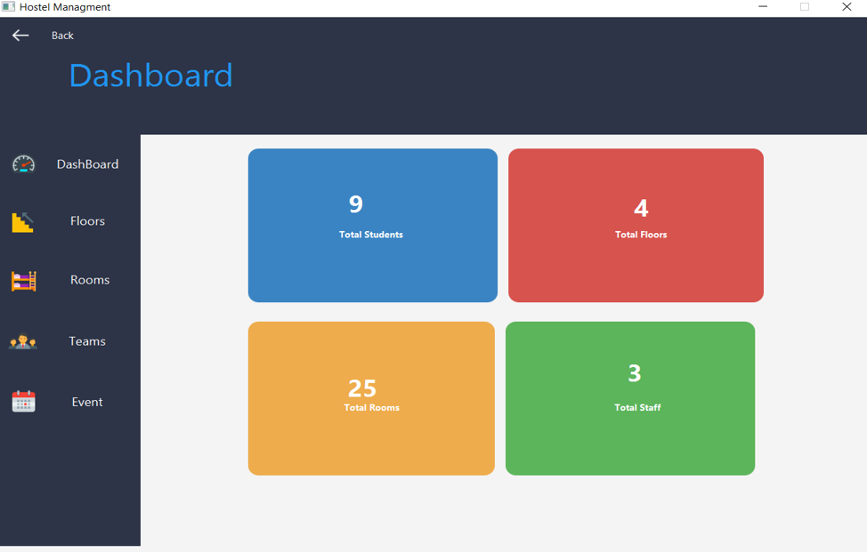
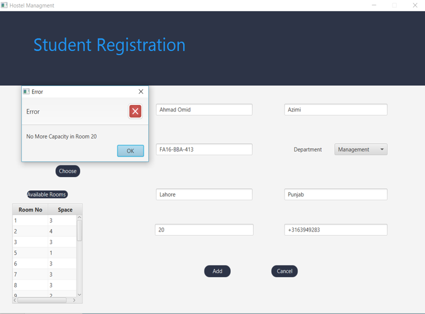

# Hostel-Management-System
Hostel Management System is a JavaFX and SQL Server desktop application.
This application allows you to store and manage Hostel data, records in Database.

Technologies used:

1 Frontend Design Tool: FXML

2 Code Standard: Java

3 Database: SQL Server

This application is free to use and the code is available to anyone.

# Screenshots

